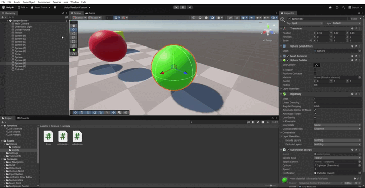
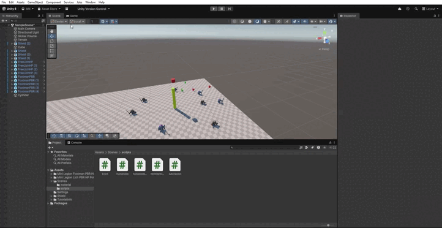
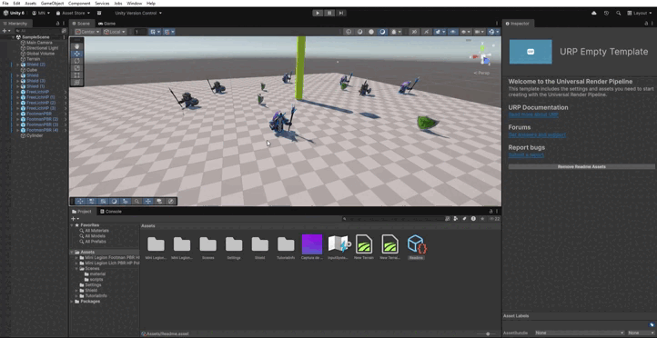
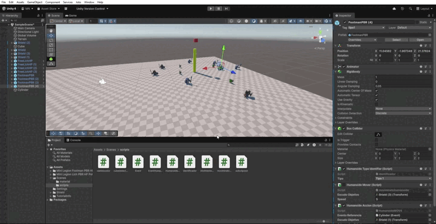
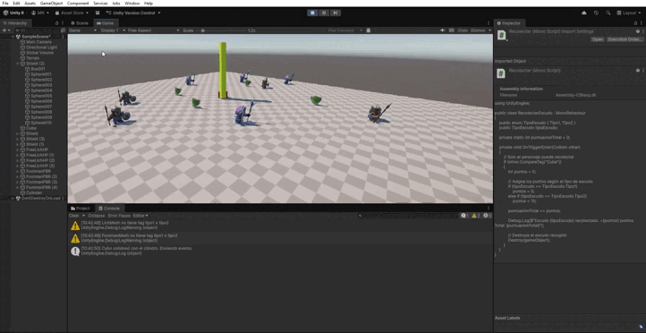
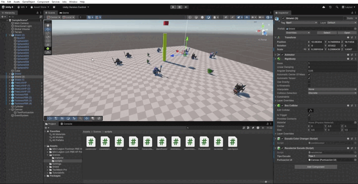
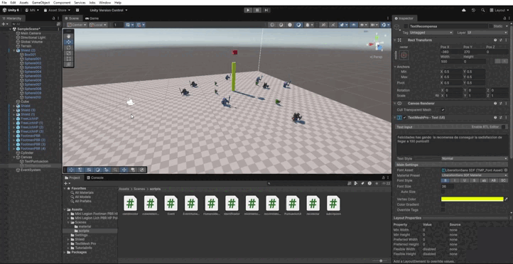
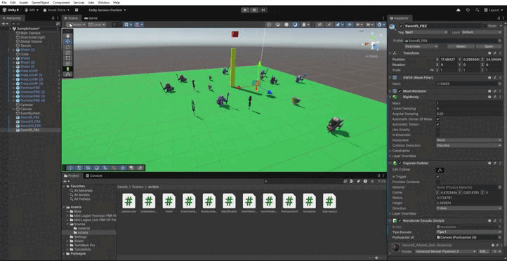

# Práctica 04 - Sistemas de Interacción (SI)

## Eventos
En esta práctica usaremos eventos para generar distintos escenarios.

## Pelotas verdes y rojas
En este escenario se crean **5 esferas rojas** y **5 esferas verdes**, además de **un cubo** y **un cilindro**.  
El cilindro será el encargado de **generar el evento** (mediante el script `Event`), mientras que las esferas se **suscriben a dicho evento** (con el script `Subcripcion`).

El cilindro, además, funciona como un **trigger** que reacciona al ser golpeado por el cubo (que actúa como nuestro personaje principal, o **PJ**).  
Cuando se produce este evento, las **pelotas rojas** se dirigen hacia la posición de una de las **pelotas verdes**, y las **pelotas verdes** se desplazan hacia el **cilindro**.

## Guerreros y Magos 
  Repetimos esl caso anteriro solo que aqui sustituimos a las pelotas por **magos** y **guerros** de los asset de la practica.

  

## Guerreros y magos 2

En este caso tenemos a los **magos**, que son NPC del **tipo 1**, y a los **guerreros**, que son NPC del **tipo 2**.  
Cuando nuestro personaje (el cubo) colisiona con alguno de los personajes del **tipo 2**, los NPC del **tipo 1** se dirigen hacia unos **escudos** previamente asignados y además **cambian de color**.  
Si el cubo colisiona con un NPC del **tipo 1**, ocurre lo mismo pero al revés: los personajes del **tipo 2** se mueven hacia sus escudos correspondientes y también **cambian de color**.

Estos eventos se gestionan a través de un **script global llamado `EventManager`**, que se encarga de **emitir mensajes** cuando se produce una colisión con un tipo u otro de NPC.  
Los NPC están suscritos a estos eventos mediante sus propios scripts, y reaccionan dependiendo de su tipo.

El script **`EventManager`** define dos eventos principales:

- **`OnMiTipo1ColisionConCubo`**: se activa cuando el cubo colisiona con un NPC de tipo 1.  
- **`OnMiTipo2ColisionConCubo`**: se activa cuando el cubo colisiona con un NPC de tipo 2.  

El script **`CubeDetector`** se encarga de **detectar las colisiones del cubo con los NPC** y **avisar al `EventManager`** para que dispare el evento correspondiente.

Cada NPC tiene un componente **`HumanoideTypeIdentifier`**, que determina si pertenece al **tipo 1** o al **tipo 2** según su etiqueta en el inspector (`tipo1` o `tipo2`).

Por último, el script **`HumanoideMover`** se encarga de **escuchar los eventos enviados por el `EventManager`** y de **mover al NPC hacia su escudo asignado** cuando corresponde.  
En este script, los NPC del **tipo 1** se mueven si se detecta una colisión con un **tipo 2**, y los NPC del **tipo 2** se mueven si la colisión fue con un **tipo 1**.  
El movimiento se realiza suavemente mediante una **corrutina** que los desplaza hacia la posición del escudo.

En conjunto, estos scripts permiten crear un **sistema de interacción** en el que los personajes reaccionan dinámicamente a las colisiones de nuestro personaje principal, gestionando la comunicación de eventos de forma global y ordenada.

## Guerreros y Magos 3 (Teletransportación y Orientación)

En este caso no hacemos que los NPC se desplacen gradualmente (como en los ejercicios anteriores), sino que los **guerreros** se **teletransportan directamente** a la posición de los **escudos** previamente asignados, mientras que los **magos** se **orientan hacia la dirección del cilindro**, que es el objeto que maneja este evento.

Para lograrlo, utilizamos nuevamente el **script `Event`** como sistema local de comunicación, y un nuevo script llamado **`HumanoideMOV4`**, que reemplaza el movimiento progresivo por acciones instantáneas de teletransportación y orientación.

El script **`HumanoideMOV4`** está suscrito al evento local del cilindro.  
Cuando el evento se activa:

- Los **NPC del tipo 1 (guerreros)** se **teletransportan inmediatamente** a la posición de su escudo asignado.  
- Los **NPC del tipo 2 (magos)** se **orientan** mirando hacia el cilindro, ajustando su rotación para apuntar en esa dirección.

El script utiliza una referencia al **tipo de NPC** mediante el componente `HumanoideTypeIdentifier`, y en la función de reacción (`Reaccionar`) decide qué acción realizar según si el personaje es del tipo 1 o del tipo 2.

De esta forma, los eventos vuelven a coordinar el comportamiento entre distintos tipos de NPC, pero esta vez implementando **acciones instantáneas** como la teletransportación y la orientación, en lugar de movimiento progresivo.

## Recolección de Escudos

En este caso, nuestro personaje **cubo** debe **recolectar los distintos escudos** que hay en la escena.  
Los **escudos de tipo 1** otorgan **5 puntos**, mientras que los **escudos de tipo 2** otorgan **10 puntos**.

Para implementar esta mecánica se utiliza el **script `recolectar` (versión antigua)**, que permite que cada vez que el cubo toque un escudo, este **sume su cantidad de puntos correspondiente** y luego **desaparezca de la escena** (el objeto es destruido).

Es importante que los **colliders de los escudos** estén configurados con la opción **`Is Trigger`** activada, para que el evento de recolección se detecte correctamente cuando el cubo entre en contacto con ellos.

## Interfaz de Puntuación

Para este ejercicio hemos creado un **Canvas** con un **TextMeshPro** que sirve como interfaz para mostrar cómo **aumentan los puntos** al recolectar los escudos.  
Para ello utilizamos los scripts **`PuntuacionUI`** y una versión modificada del script de **`recoleccion`.

El script **`recoleccion`** se encarga de detectar cuando el **cubo** entra en contacto con un escudo (mediante un *trigger*).  
Según el tipo de escudo, se asignan los puntos correspondientes.Cada vez que se recolecta un escudo, se llama al método `SumarPuntos()` del script **`PuntuacionUI`**, el cual **actualiza el texto en pantalla**.

El script **`PuntuacionUI`** mantiene el **contador total de puntos** y actualiza el valor en el **TextMeshPro** del Canvas. 

## Obtener premio por pantalla

Esta mecánica es muy similar a la del apartado anterior de **Interfaz de Puntuación**, pero ahora nos enfocamos en la **notificación de premio** que aparece cuando el jugador alcanza los **100 puntos**.  

Cada vez que se suman puntos, el método `SumarPuntos()` del script **`PuntuacionUI`** **actualiza el contador en pantalla**.  
Cuando el total de puntos alcanza un **múltiplo de 100**, se activa un **mensaje de premio** en el Canvas para notificar al jugador que ha alcanzado esta meta.  
Este mensaje aparece de manera temporal y se oculta automáticamente después de unos segundos.  

## Recoleccion de Espadas

  Se añadido unos asset de la store de Unity de espadas, especificamente el ** Espadas de baja poligonización - Armas de rol**, y se les  a añadido los scrips de los escudos, para que el personaje pueda recolectar espadas
  y estas les den puntos, y añadir un color al terreno (que me di cuenta de que no lo puse al final disculpe las molestias).

## Cubo Fisico
  Es exactamente igual que el 3 ejercicio , pero el cubo siendo fisico ( en mi caso ya lo era).

  
  

